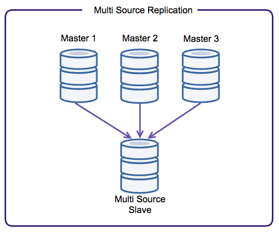
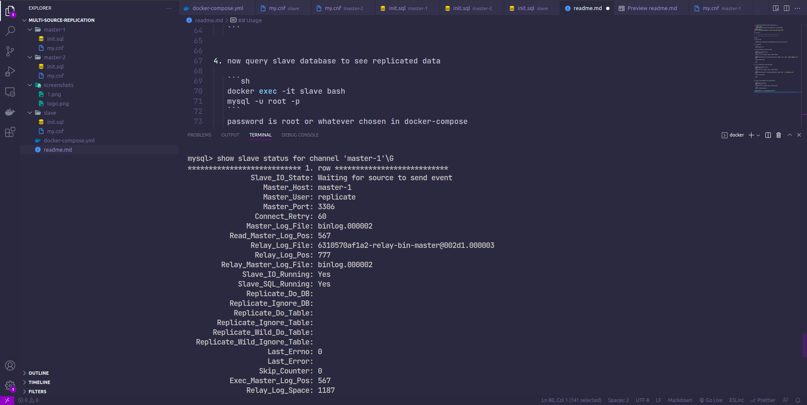
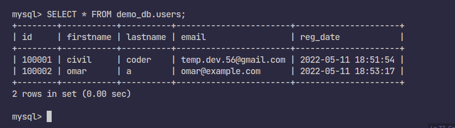

  <h3 align="center">MYSQL Multi-Source Replication</h3>

  <p align="center">
      demo multi-source replication implementation in mysql database 
  </p>
  
<p align="center">
  
</p>

## Screenshots

<p align="center"></p>

## Usage

1. Clone the repo

   ```sh
   git clone https://github.com/civilcoder55/mysql-multi-source-replication.git
   ```

2. run containers

   ```sh
   docker-compose up -d
   ```

3. try to add some data in the first master

   ```sh
   docker exec -it master-1 bash
   mysql -u root -p
   ```

   password is root or whatever chosen in docker-compose

   ```sh
   INSERT INTO demo_db.users (firstname,lastname,email) VALUES ('civil','coder','temp.dev.56@gmail.com');
   exit
   ```

   to exit container bash

   ```sh
   exit
   ```

4. try to add some data in the second master

   ```sh
   docker exec -it master-2 bash
   mysql -u root -p
   ```

   password is root or whatever chosen in docker-compose

   ```sh
   INSERT INTO demo_db.users (firstname,lastname,email) VALUES ('omar','a','omar@example.com');
   exit
   ```

   to exit container bash

   ```sh
   exit
   ```

5. now query slave database to see replicated data

   ```sh
   docker exec -it slave bash
   mysql -u root -p
   ```

   password is root or whatever chosen in docker-compose

   ```sh
   SELECT * FROM demo_db.users;
   ```

<p align="center">⚡⚡⚡⚡⚡ 🎉🎉🎉🎉</p>
<p align="center"></p>
